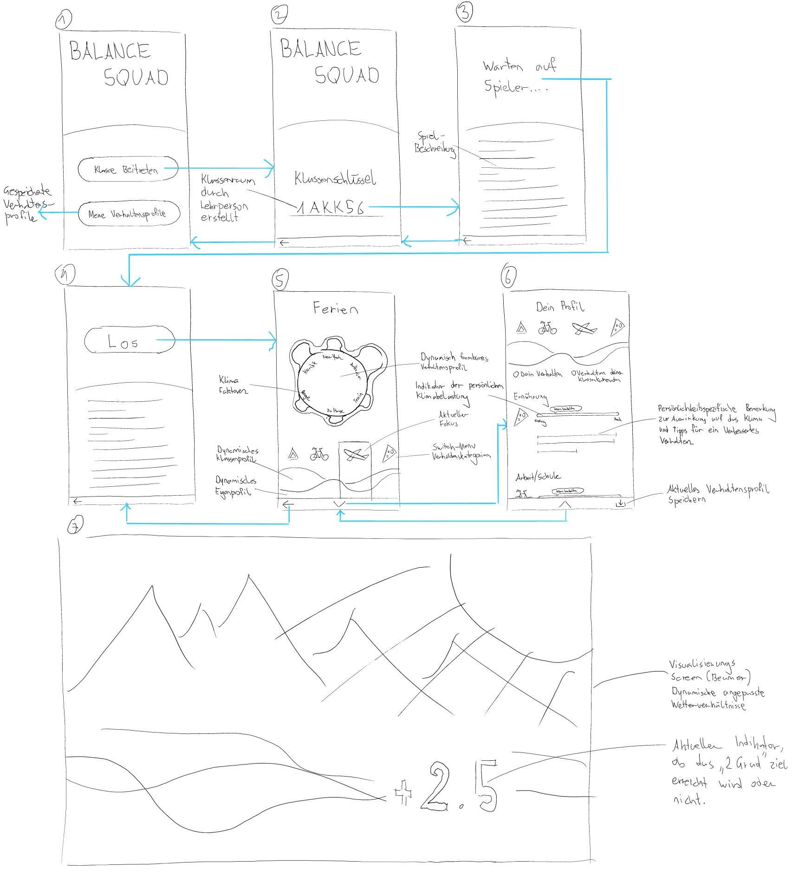
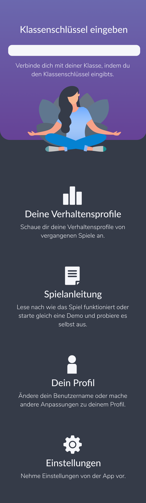
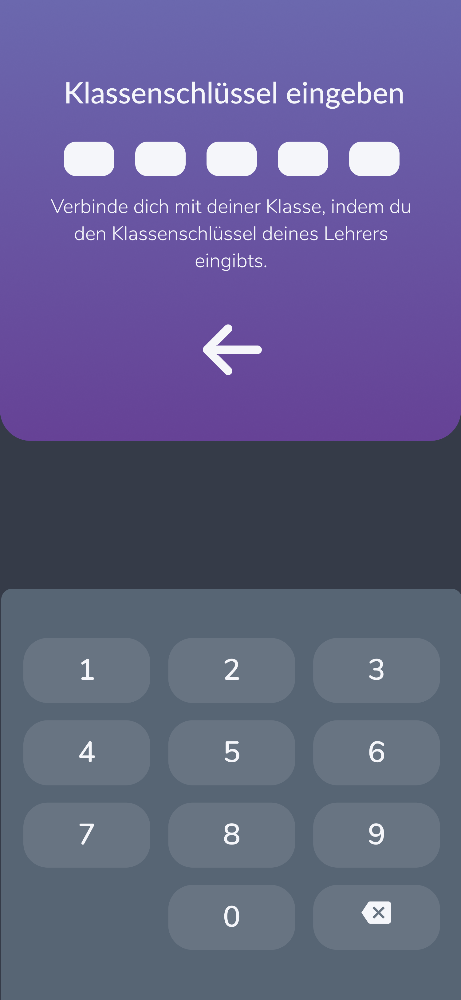
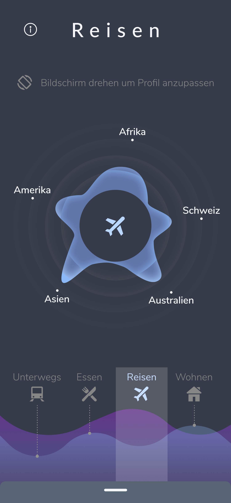
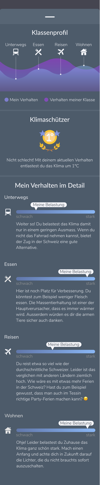
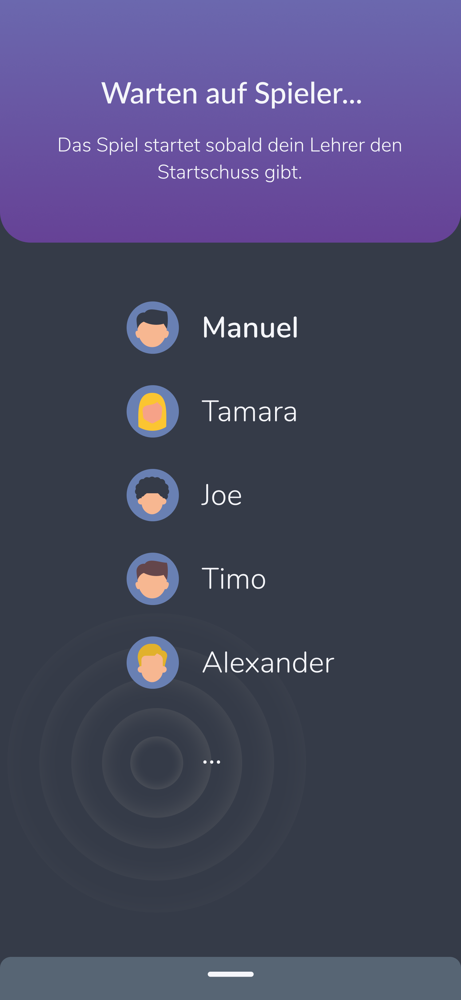
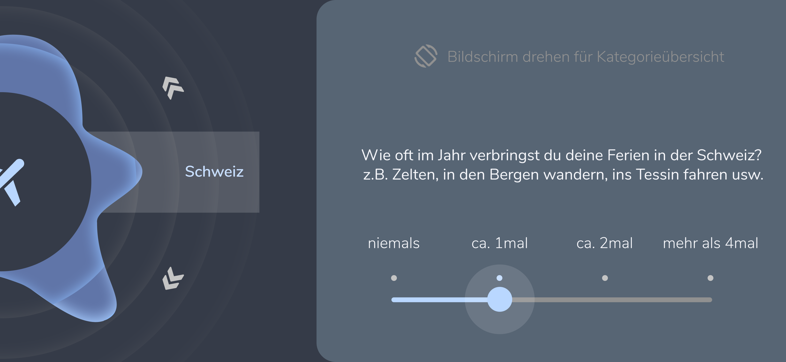

# Ein App Visual Design zur Sensibilisierung der Klimaproblematik

#### Anmerkung
Die ausführlichere Dokumentation über diese Arbeit kann aus meiner Case-Study entnommen werden: https://medium.com/@manuelriedi/ein-app-design-zur-sensibilisierung-der-klimaproblematik-532f47d5246  
Das Projekt wurde im Rahmen einer Studentenarbeit an der technischen Fachhochschule Nordwestschweiz durchgeführt. Der Inhalt der Arbeit soll lediglich zu Lernzwecken dienen.

## Inhalt und Ziel
Mit diesem Projekt soll eine Begleiter-App für den Schulunterricht entworfen werden, welche zum Ziel hat junge Menschen auf die Problematik der Globalen Erwärmung aufmerksam zu machen. Gemeinsam sollen sie ihr Verhalten auf die Umwelt reproduzieren und durch visuelle, informative und spielerische Art ihren biologischen Fussabdruck erfahren können.

## Idee
Schüler einer Klasse sollen mit dem App-Konzept “Balance Squad” (Konzeptname) ihr persönlicher biologischer Fussabdruck abbilden können. Die daraus entstehenden Daten der beteiligten Schüler werden dabei zu einem Klassenprofil verschmolzen und beispielsweise auf dem Beamer im Schulzimmer als visuelles Naturbild wiedergegeben. Steht die Klasse mit ihrem Verhalten dabei schlecht zur Natur, wird die Landschaft auf dynamische Weise entsprechend in Richtung eines apokalyptisch-ähnlichen Szenerios übergehen. Anderenfalls wird das Bild zu einer harmonische Idylle übergehen. Die Schüler müssen somit gemeinsam eine gesunde Balance für das Klima finden, indem sie gegenseitig Kompromisse eingehen, welche sie durch das Regelen klimaschädlicher Verhaltensparametern erreichen können. Neben der Durchführung dieses Spiels sollen daraus (ausserhalb der App) entsprechend Diskussionen zwischen Schülern und Lehrperson entstehen.
Damit ein Mitschüler als Individum auch aus dem eigenen Verhalten bessere Schlüsse ziehen kann, soll er zusätzlich mit nützlichen Tipps zu seinem persönlichen biologischen Fussabdruck geschult werden.

## Skizzen, Screens und Hi-Fi Prototyp
### Skizzen
Folgend sind Skizzierungen (Lo-Fi Prototyp) abgebildet. Das Navigationskonzept wird zusätzlich durch die blauen Pfeile beschrieben.

### Interaktiver Prototyp
https://www.figma.com/proto/AOEWFRMQZTQ5MoaJzmP0UR/My-adxd?node-id=261%3A236&viewport=1657%2C670%2C0.6228898763656616&scaling=min-zoom

### Screens Hi-Fi Prototyp
   

  
 

